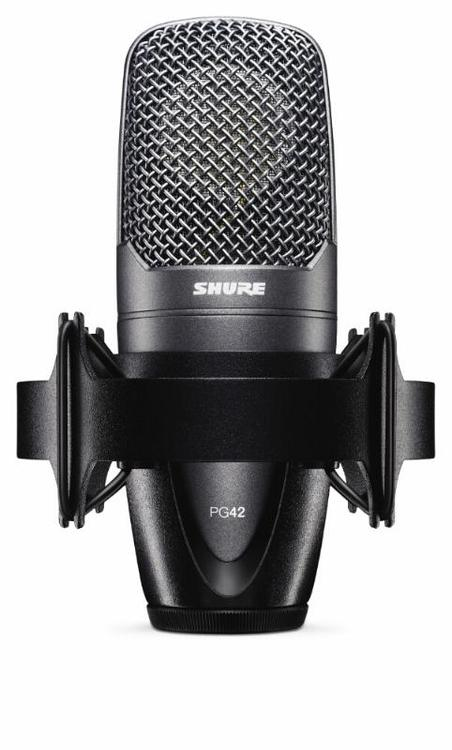
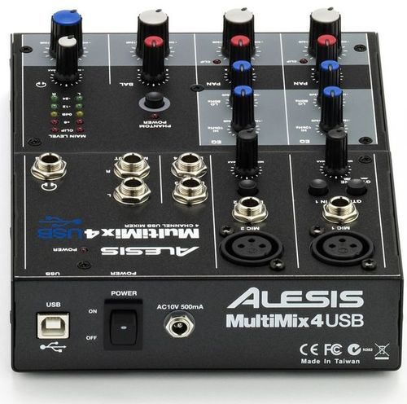

---

title: Screencasting Setup
author: Ted Hagos
categories: tools

---

1.  Shure PG42 USB Mic
2.  A mixer with phantom voltage, needs to be USB
3.  Camtasia 2 Mac - to Record the screen
4.  Audacity — surely, I cannot talk while typing. So I need to have the ability to record the voice on a separate track.

The condenser mic and the mixer is necessary to achieve an acceptably clean audio. So there is no hiss and hum on the audio.

Possible source of these equipment in MNL is <http://www.jbmusic.com.ph/product/details/alesis-mm4usb-4-channel-usb-mixer>

