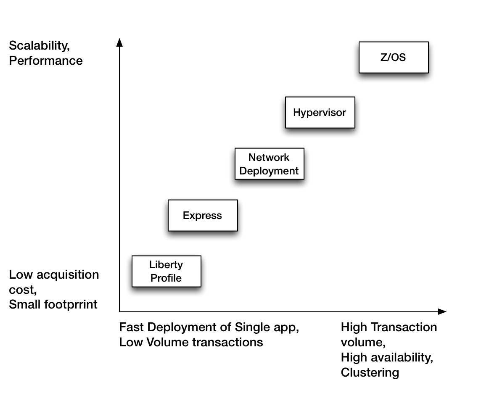
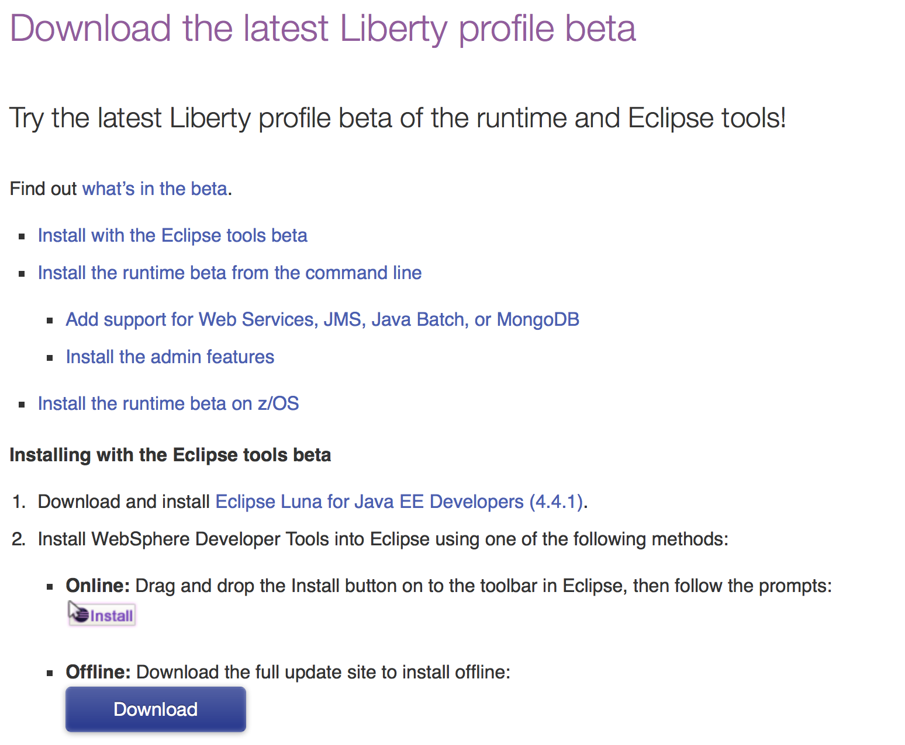

---

title: WebSphere 8.5.5 Liberty Profile
author: Ted Hagos
categories: websphere

---

# WebSphere family of products

# WebSphere Editions

# Installing the Liberty Profile

## System Requirements

Minimum supported Java Level <http://www-01.ibm.com/support/knowledgecenter/#!/was_beta_liberty/com.ibm.websphere.wlp.nd.multiplatform.doc/ae/rwlp_restrict.html>

Which OS, Windows, Linux and Mac OSX. I need to find official versions 

## Archive install

## WDT for Eclipse

## Installation Manager

# Core Concepts

## Cell, Nodes and Profiles

## Full Profile and Liberty Profile

# Liberty Profile

## Description

## Simplified Configuration

There is only one XML file 

## Dynamic runtime

## Deployment Options

# Installation

The Liberty Profile is provided as a no-charge and free to distribute set of packages. It comes as a set of jar files. 

## Stand alone

Download the jars from [WASDev.net](https://developer.ibm.com/wasdev/downloads/liberty-profile-beta/). 

<table border="2" cellspacing="0" cellpadding="6" rules="groups" frame="hsides">

<colgroup>
<col  class="left" />

<col  class="left" />
</colgroup>
<thead>
<tr>
<th scope="col" class="left">File</th>
<th scope="col" class="left">Description</th>
</tr>
</thead>

<tbody>
<tr>
<td class="left">wlp-beta-runtime-xx.xx.xx.jar</td>
<td class="left">The core runtime</td>
</tr>

<tr>
<td class="left">wlp-beta-extended-xx.xx.xx.jar</td>
<td class="left">Extended runtime, if you will need JMS, WebServices etc</td>
</tr>

<tr>
<td class="left">wlp-beta-admin-xx.xx.xx.jar\`</td>
<td class="left">A Rudimentary admin for the Liberty Profile. Very basic</td>
</tr>
</tbody>
</table>

Install each of the executable jars above using

    java -jar wlp-runtime-xx.xx.xx.jar

Replace the xx.xx.xx with the actual values of the jar file names you downloaded. The above command will install the Liberty Profile runtime. It will ask for a few questions e.g. would you like to read the license, do you accept the license and which directory would you like to install the Liberty runtime. The default installation directory is the current directory where you ran the **java -jar** command. From hereon, we will refer to this directory as **wasroot**

Next, install the extended runtime jars and the admin jars. It will ask for exactly the same questions.

    java -jar wlp-beta-extended.xx.xx.xx.jar
    java -jar wlp-beta-admin.xx.xx..xx.jar

## Installing the Liberty Profile in Eclipse

If the [WASDev.net](https://developer.ibm.com/wasdev/downloads/liberty-profile-beta/) page is still open in your browser, look for the **Online** icon. Drag and drop the icon with the Eclipse logo inside an open instance of Eclipse. That will launch an installation window. 

You can also install the Liberty tools in Eclipse by using the Eclipse Market Place.

1.  Open Eclipse
2.  From the Help menu, click **Market Place**
3.  Search for **WebSphere**
4.  Look for Liberty Profile for Luna. If you are using Eclipse Luna, otherwise, find the Liberty Profile for whatever edition of Eclipse you are using

Follow the prompts. Eclipse will restart after the installation

### Creating the server in Eclipse

1.  Click **File**, **New**, **Other**
2.  Find the **Server** option
3.  When asked to select the Server type, look for the **IBM** folder and click **WebSphere Application Server v8.5 Liberty**
4.  Accept the default server name

It will ask you to either point to an existing Liberty Profile runtime or define a new location. We have already installed our runtime above, so we will use that folder

# Creating Servers

The server scripts that you will need need are inside the \*wasroot\*/bin folder. For purposes of convenience, you may include that folder into your system path so you can invoke them from any directory

You can define many servers inside the Liberty Profile. Each server you create will be stored in the **wasroot** /usr/servers folder. Each server will have its own self contained configuration. 

To create a server, run the command

    server create firstServer

This will create a server folder named firstServer. You should now see it in **wasroot** /usr/servers/firstServer

## Starting and Stopping servers

To start a server, use the command **server run firstServer**. This will run the server in the foreground, which means you will see all the console logs on the terminal. You can also start the server using the command **server start firstServer** which will run the server in the background. You will not see the cconsole logs in the terminal, but they are logged inside **wasroot** /logs/console.log

A server that was started using the **server run** can be stopped by pressing **CTRL C**. If you started the server using **server start**, you need to stop it using the command **server stop firstServer**

## Server Configuration

The server configuration in WAS 8.5 is now a development artifact. This is a good thing because it is now simpler to include the server configuration in source control. When a server is created, you are given a really basic configuration file, but it has reasonable defaults. The Liberty Profile is configured by exception. It operates from a set of built-in configuration settings. 

Each server you will create will reside inside the **wasroot** /usr/servers folder. In our earlier example, we created a server named **firstserver**. That server definition is inside **wasroot** /usr/servers/firstserver

    .
    ├── apps
    ├── dropins
    ├── logs
    ├── server.xml
    └── workarea
    
    4 directories, 1 file

The **server.xml** file is located in the top level directory of a defined server, which in our case is named **firstserver**. If you try to run this server right now, without adding any JSP, Servlet or even a static HTMl file, you won't see much. You will simply see the greeting page of the Liberty Profile. We will add some development assets to this project in a little while.

The listing below is an example of a server configuration for a newly created server

    <server description="new server">
    
        <!-- Enable features -->
        <featureManager>
            <feature>jsp-2.2</feature>
        </featureManager>
    
        <!-- To access this server from a remote client add a host attribute to the following element, e.g. host="*" -->
        <httpEndpoint httpPort="9080" httpsPort="9443" id="defaultHttpEndpoint"/>
    
    </server>

The Liberty Profile's default port number is **9080**. It will listen on this port the moment you start a server. If you want your application to listen to another port number e.g. port 80, you simply need to change the value of **httpPort** in the server.xml file.

    <server description="new server">
    
        <!-- Enable features -->
        <featureManager>
            <feature>jsp-2.2</feature>
        </featureManager>
    
        <httpEndpoint httpPort="80" id="defaultHttpEndpoint" host="*"/>
    
    </server>

The listing above has two changes. The httpPort is now listening on port 80. Which means that when you access this on your browser, you won't need to specify the port number anymore because 80 is the default for all browsers when it makes an HTTP request. The other change is that I have added a **host** attribute in the httpEndPoint element. This will allow you to access the application from any device other localhost. If you don't specify the host attribute, you will not be able to access your application from remote machines.

The server.xml configuration file has the following characteristics

1.  It is purely XML. Hence you can manage it using the simplest of editors. As such, it also human readable
2.  It is small, easy to back up and simple to include in a source control
3.  It can be shared across an application development team
4.  Composeable and feature driven. Features that you will add can easily add their own configuration to the system
5.  Forgiving. If you missed an attribute on the feature declaration, the built-in default values will kick in. The level of frustration is low

## Features

Features are the units of functionality by which you control the pieces of the runtime environment that are loaded into a particular server.

Use the configuration file server.xml to declare which features you want to load. The set of features is enclosed within the **<featureManager>** element, and each feature within the **<feature>** subelement. For example:

    <server description="boo server">
      <dataSource jndiName="jdbc/mysql">
        <jdbcDriver id="mysqlDriver" libraryRef="mysql-connector"/>
        <properties URL="jdbc:mysql://localhost/liberty" password="" user="root"/>
      </dataSource>
     
      <library description="MySQL JDBC Driver" id="mysql-connector" name="MySQL Connector">
        <fileset dir="/Users/ted/progtools/mconnector" id="mysql-connector-jar" includes="mysql-connector-java-*.jar"/>
      </library>
     
      <featureManager>
        <feature>localConnector-1.0</feature>
        <feature>servlet-3.0</feature>
        <feature>jdbc-4.0</feature>
      </featureManager>
     
      <applicationMonitor updateTrigger="mbean"/>
     
      <application id="AccessMySQL" location="AccessMySQL.war" name="AccessMySQL" type="war"/>
      <httpEndpoint httpPort="9080" httpsPort="9443" id="defaultHttpEndpoint"/>
    
        <webApplication id="DBAccess" location="DBAccess.war" name="DBAccess"/>
    </server>

The listing above is a server that uses quite a few features. It uses jdbc4 and servlet3 features. The localconnector was added to this server so we can use the Java Management Extensions, **jmx**, on this local server. It just speed things up a bit. For a more complete list of features, refer to [Liberty Features page](http://www-01.ibm.com/support/knowledgecenter/api/content/nl/en-us/was_beta_liberty/com.ibm.websphere.wlp.nd.multiplatform.doc/ae/rwlp_feat.html)

## Eclipse

Use the context menu of Eclipse to start, stop and restart the server

# Deploying Apps

## Eclipse

## Command Line

# Recipes

## JSP

1.  File, **Dynamic Web Project**
2.  Use the default location
3.  Check that Target Runtime is **WebSphere Application Server Liberty Profile**
4.  Dynamic web module version is 3.0
5.  Uncheck **Add the project to an EAR**, we will not be adding this to an Enterprise Archive
6.  We do not need to generate a web.xml file for this exercise, we will use the defaults of the Liberty profile. Click Finish
7.  On the **Servers** tab of Eclipse, use the context menu of our defined Liberty Profile server. Right click and choose **Add and Remove**
8.  Add a JSP file to our Project. Right click on the project, choose **New JSP**. Accept the defaults, they are reasonably right
9.  When the JSP editor opens in Eclipse, just add whatever text you want inside the **body** tag

9.. Add the JSPSample project. Choose it from the list of **Available**, click the Add button so it goes to the **Configured** list and click **Finish**

1.  On the servers tab, right click on our defined Liberty server, and choose **Start**
2.  Open a browser and open <http://localhost:9080/JSPSample/Sample.jsp>

## Servlet

Create a new project in Eclipse, **File**, **New** then choose **Dynamic Web Project**. Give the project a name, say, **third**  and then uncheck the **Add Project to an EAR**. We won't be using EAR files still. Follow the prompts and click Finish. Add a Servlet to project third, give it a name and specify any package to your liking. Implement the **doGet()** method and add a simple println command to it

    package com.tedhagos;
    
    import java.io.IOException;
    import java.io.PrintWriter;
    
    import javax.servlet.ServletException;
    import javax.servlet.annotation.WebServlet;
    import javax.servlet.http.HttpServlet;
    import javax.servlet.http.HttpServletRequest;
    import javax.servlet.http.HttpServletResponse;
    
    /**
     * Servlet implementation class Tres
     */
    @WebServlet("/Tres")
    public class Tres extends HttpServlet {
    private static final long serialVersionUID = 1L;
           
        /**
         * @see HttpServlet#HttpServlet()
         */
        public Tres() {
            super();
            // TODO Auto-generated constructor stub
        }
    
    /**
     * @see HttpServlet#doGet(HttpServletRequest request, HttpServletResponse response)
     */
    protected void doGet(HttpServletRequest request, HttpServletResponse response) throws ServletException, IOException {
    // TODO Auto-generated method stub
    PrintWriter out = response.getWriter();
    out.println("Hello Tres");
    }
    }

In our JSP example earlier, we deployed the JSP project by using the **Add and Remove** context menu of the Liberty Profile server in Eclipse. For this example, we will explore the command line deployment.  

Export a war file for our project third. You can do this in Eclipse by clicking **File**, **Export**, then find the folder named Web, select **WAR file**. Click the next button. Choose project third from the Web Project drop down. Choose a destination folder. This folder is where Eclipse will write the war file.

Next, copy the export war file to **wasroot** /usr/servers/firstserver/dropins. The **dropins** folder is constantly polled by the Liberty Profile. Any WAR or EAR file that you put here will be decompressed and deployed.  

## JDBC

There are 
1.  Prepare the database
2.  Server XML features
3.  The servlet which that access the database

### Database preparation

We will use a MySQL database for this example. The SQL script in the code listing below basically creates a database named "liberty" and  a table named "users" with a single column. 

    drop database if exists liberty;
    create database liberty;
    use liberty;
    create table users (
      id MEDIUMINT NOT NULL AUTO_INCREMENT,
        name CHAR(30) NOT NULL,
          PRIMARY KEY (id));
    desc users;

### Server configuration

    <server description="boo server">
      <dataSource jndiName="jdbc/mysql">
        <jdbcDriver id="mysqlDriver" libraryRef="mysql-connector"/>
        <properties URL="jdbc:mysql://localhost/liberty" password="" user="root"/>
      </dataSource>
     
      <library description="MySQL JDBC Driver" id="mysql-connector" name="MySQL Connector">
        <fileset dir="/Users/ted/progtools/mconnector" id="mysql-connector-jar" includes="mysql-connector-java-*.jar"/>
      </library>
     
      <featureManager>
        <feature>localConnector-1.0</feature>
        <feature>servlet-3.0</feature>
        <feature>jdbc-4.0</feature>
      </featureManager>
     
      <applicationMonitor updateTrigger="mbean"/>
     
      <application id="AccessMySQL" location="AccessMySQL.war" name="AccessMySQL" type="war"/>
      <httpEndpoint httpPort="9080" httpsPort="9443" id="defaultHttpEndpoint"/>
    
        <webApplication id="DBAccess" location="DBAccess.war" name="DBAccess"/>
    </server>

## Session Bean

## JPA

## Message Driven Bean

# JVM Tuning

Each server created in the Liberty Profile comes with the default JVM options. The defaults are reasonable but in case you need to tweak it, you simply need to create a file named jvm.options and place it at the root directory of a server folder. In our case, if we would like to alter some settings of JVM for our **firstserver**, we need to create the options file and place in **wasroot** /usr/servers/firstserver/jvm.options. If you want the JVM options to be applicable to all servers, put the options file in **wasroot** /etc/jvm.options.

A change in the JVM options is one of the rare occassions where you have to restart your servers.  

One of the most settings tweak that is done to the JVM is to alter the memory allocated to JVM. By default, Liberty Profile has the following setting

    -Xms4m
    -Xmx488m

That means the minimum Java heap size is 4 megabytes and the maximum heap size is 488 megabytes

On the rare occassion that you want to see a verbose log of the garbage collection process, you can include the following setting on the jvm.options. 

    verbose:gc

There are many settings that can be set in the jvm.options file, for a complete reference, you can consult this page [JVM Options page at Xebia.fr](http://jvm-options.tech.xebia.fr)

# Server options

# Resources

1.  Redbooks
2.  IBM

