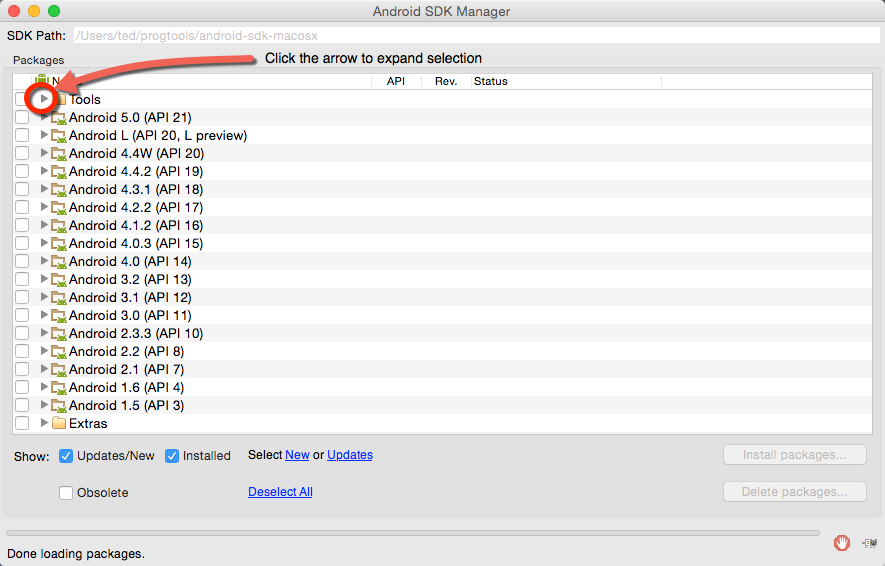
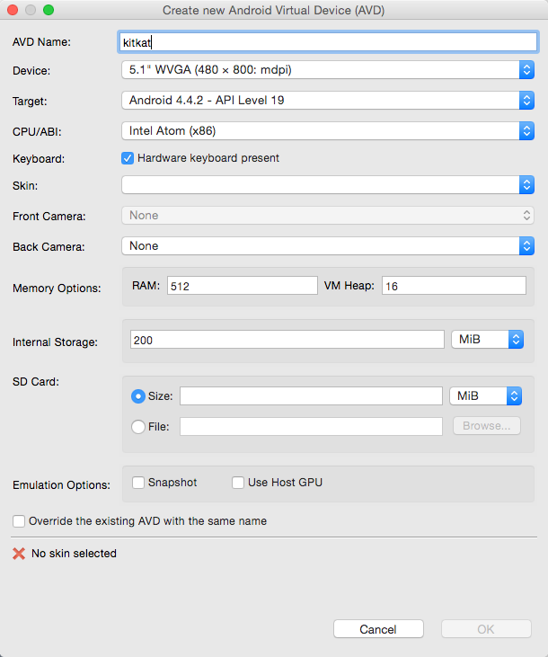

---

title: CLI Development Environment
author: Ted Hagos

---

The Android SDK is a collection of tools and libraries to help you build Android projects. Before you can create projects, you must install the SDK. The SDK also installs, among other things, the Android Virtual Device or the AVD. The AVD emulates a physical android device. You can use this for testing your applications.

The SDK depends on other software. You need to make sure that you have the following installed on your system.

-   A Java Development Kit. You will need the full JDK not just the JRE. The JRE is good only for running Java software, not for developing them. The prescribed versions of JDK is either 1.5 or 1.6 but I have experience running them on Java 7 and 8 without problems
-   Apache Ant will also be needed. Android uses Ant as a build tool

# Download

The SDK can be downloaded from <https://developer.android.com/sdk>. Click the link which says "View all downloads and sizes". The SDK is available for Mac, Linux and Windows, find the right installer for your platform and download it.

# Configure

At the time of writing, the SDK is packaged as a zipped file.  Unzip the downloaded file somewhere your disk. Unzip it preferably to a directory where you have read,write and execute privileges so you do not have to worry about tweaking permissions later. The name of directory where you unzipped the SDK files will be known as ANDROID\_HOME. 

    ~/android-sdk-linux/
    
    ├── add-ons
    ├── build-tools
    ├── docs
    ├── platforms
    ├── platform-tools
    ├── samples
    ├── sources
    ├── system-images
    ├── temp
    └── tools

The diagram above shows the folder structure of the unzipped SDK files on a Linux box. If you are on Windows, this could be **c:\\>Users\yourname\android-sdk-windows**. On a Mac it could read **~/android-sdk-mac**.

There are two specific folders in the ANDROID\_HOME that you must include in your system path, the tools folder and the platform-tools folder.  The common utilities and commands that you will use in Android Development are found on those folders. 

## Mac

You can edit your **~/.bash_profile** and include the following

    export ANDROID_HOME=/<location of android home>
    export PATH=$PATH:ANDROID_HOME/tools:$ANDROID_HOME/platform-tools:.

Replace <location of android home> with the actual directory location of your ANDROID_HOME

## Linux

You can edit **~/.bashrc** and include the following

    export ANDROID_HOME=/<location of android home>/
    export PATH=$PATH:$ANDROID_HOME/tools:$ANDROID_HOME/platform-tools:.

Replace <location of android home> with the actual directory location of your ANDROID_HOME

## Windows

You can include the path of tools and platform-tools using the GUI tools. Go to Control Panel, System Properties then go Environment Variables. You can put it either in User or System variables. If you do not have Administrative privileges on the Windows machine, you may not be able to alter the System variables. 

Alternatively, you can create a batch file somewhere on your user directory and set the paths on that batch file.  Launch cmd.exe to get a command line window

    cd \Users\<yourname>
    notepad adev.bat

Write the following inside adev.bat

    set ANDROID_HOME=c:\<location of android home>
    set PATH=%PATH%/tools;%ANDROID_HOME%/platform-tools:.

You will need to run this batch file each time you open a cmd window so the Android path information can be recognized. The moment you close the cmd window, these path settings will be lost. If you include the Android paths using the System Properties method, will be permanent. Each time you open an cmd window, the paths will be set automatically.

# Download the Android versions

The SDK includes just the tools and utilities for development. It does not include the specific Android platform libraries that you will need. You will need to download the specific platforms/versions using the SDK manager. You may also need to download system images which will be required when you create an emulator. 

Open a terminal window and type 

    android

This will launch the Android SDK Manager. If you get a "bad command command or file name" or a "command not found error" that means you have not included the **tools** and **platform-tools** folder of the SDK into your PATH. Fix that first, then try the **android** command again.

Android has been around for quite some time. There have been several versions of it over the course of many years. Each version of the Android platform can be downloaded using this tool. If you have a lot of bandwidth and disk space, you can download all of them by ticking all the check boxes you can find. Or you can simply download the Android versions you want to target for development.

If you want to develop apps that will run on KitKat, tick the box of "Android 4.4.2 (API 19)". At a minimum, you will need the "SDK platform", so check that. You will also need the "System Images", check those that you want to use. If you are unsure which System Image you will need, just check "Intel X86 Atom System Image".  

Scroll down the SDK Manager window and go to the "Extras" section. Check the "Android Support Library". If you are on Windows, you might need the "Google USB Driver", Mac and Linux users do not need the drivers. The USB drivers will be needed if you use a real Android device to run and test your app.  

Once you are happy with your selections, click the "Install packages" button. You will have to accept the license agreement before any download begins.  

# Android Virtual Device

The Android Virtual Device emulate a real device. You can use this for testing your apps in place of a real device. I do highly recommend testing your app on real device before you release to the public. There is no substitute with real device testing.

## Create an AVD

You can create an AVD for any Android platform provided that you downloaded a System Image for it. To create an AVD, use the following command on a terminal window

    android create avd --name kitkat --target android-19 --abi default/x86

The preceding command will create an an AVD for android API level 19, which is KitKat version. It was given a name "kitkat" using the &#x2013;name flag. The System Image used was the default/x86 image (Intel X86 Atom System Image). 

If you are wondering how did we know what values to put in the command options, that answer is we got them by listing the available android targets. You can view the available targets using the command **android list targets**. It will list all the versions of Android which you downloaded earlier using the SDK Manager. Below is a snippet of the output using the android list targets command.

    id: 11 or "android-19"
         Name: Android 4.4.2
         Type: Platform
         API level: 19
         Revision: 4
         Skins: HVGA, QVGA, WQVGA400, WQVGA432, WSVGA, WVGA800 (default), WVGA854, WXGA720, WXGA800, WXGA800-7in
     Tag/ABIs : default/armeabi-v7a, default/x86
-   **&#x2013;name**. Put any name you want, I used kikat in our example because it is descriptive
-   **&#x2013;target**. The API Level for your application. If we wanted to create a project that will run on JellyBean, I would have put android-18. But I did put android-19 because I wanted the app to run on KitKat
-   **&#x2013;abi**.  The name of the System Image that you will use for the emulator, in our example above I could also have used default/armeabi-v7a because it is also listed among the available targets

The create avd command has a couple of options you can use, but we only used three of them. You can pass other options that will affect things like skin, sdcard storage etc.  You can learn the other options of this command by typing **android create avd** without any options. That will display the help file.

Overtime, you will create more AVDs because you will target different Android versions. To find out how many and what kind of AVDs you already have created, use the command

    android list avd

That command will output the details of all the AVDs you have created.

You can test the AVD you just created by launching it

    emulator -avd kitkat

This command will launch the emulator in its own window. Just close the window if you want to terminate the emulator. 

## Alternative AVD Management

The creation and management of AVDs can also be accomplished using the GUI tool of the Android SDK Manager. Launch the SDK Manager again using the **android** command from a terminal window. Go to "Tools" then "Manage AVDs". 

