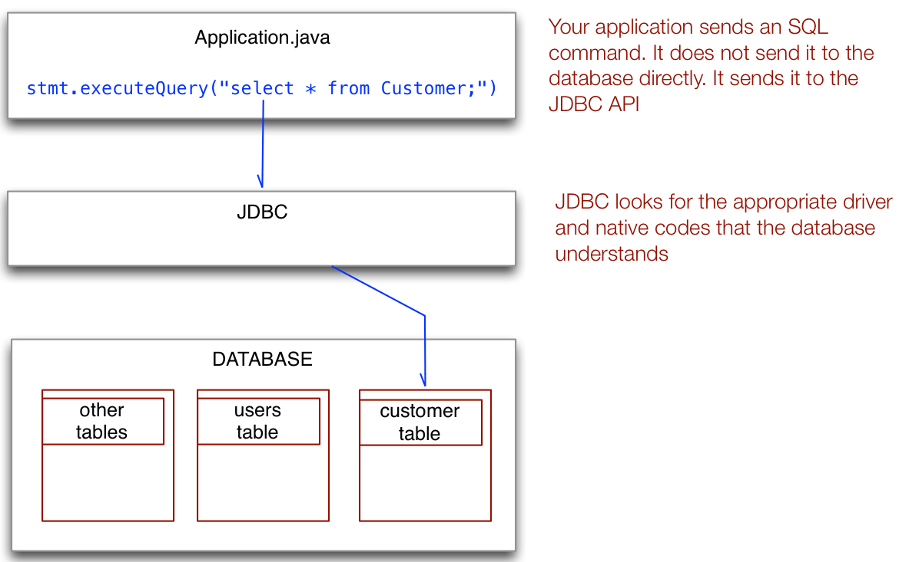

---

title: JDBC Programming
author: Ted Hagos
categories: java

---

A  database is a store of information. Logically, it is place where you tuck away any data that you intend to retrieve or manipulate any time in the future. It is a durable storage. Any information that you store in  a database is guaranteed to be saved even if the application that created the data is no longer running. A database outlives your application. 

All data will ultimately end up as a file. That is the physical destination of all data stores. These files can vary widely when it comes to their physical representation. The simplest one is a text file and the information is written in a way that humans can read it when they open the file using a basic text editor. It can also be very elaborate where you split the information across many files. These files may not be human readable. You will need some intervening software process in order for the information to make sense. Our current subject of discussion is the latter one. Most mainstream databases organize information using a software process. 

# Database programs

There are many software packages that offer database management e.g. Oracle, Microsoft SQL Server, MySQL, PostgreSQL and SQLite, to name a few. Each one has characteristics that set it apart from the others. Their merits and differences are beyond the scope of the current discussion. For our purposes, we will use SQLite. 

SQLite has been chosen because it is fairly easy to install, configure and use. 

# Structured Query Language

Brief explanation, types of database. What is SQL

Why we are using SQLite

Some practice codes on SQLite. Prep code on SQLite, populate our database

# JDBC

# Reading records from a databse

# Other types of queries

There are other types of queries.

# Metadata

no. yes. no
