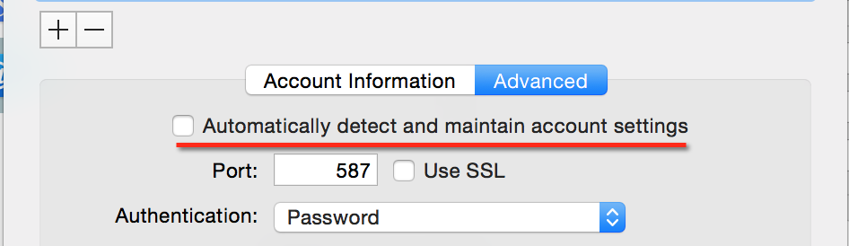

---

title: OSX Yosemite Mail Problem
tags:
- mail

---

Mail.app in Yosemite has a default setting of using **secure authentication** when it sends password. If you email server is not using secure authentication for checking credentials, you will not be able to send out any email.

The fix is simple. You only need to uncheck two option boxes on the **Accounts Preferences** window of Mail.app. The two checkboxes will prevent Mail.app from overriding your manual setting. One of them is found on the "Advanced" tab of the Accounts Preferences and other other one can be found on the "Edit SMTP Server list" window. You will also need to check one option box that will allow you to send plain username and password to your server.

When Mail.app is open, go to **Mail** menu,  **Preferences**, then click the **Accounts** tab.

Uncheck the box that says "Automatically detect and maintain settings". If this is checked, Mail.app may overwrite whatever settings you change. We don't need that. On the same window, find the option box that says "Allow insecure authentication". This will let you authenticate using plain username and passwords.

From the "Advanced" tab, go to "Account information" tab and find the dropdown box for "Outgoing Mail Server".

Click the dropdown and go to "Edit SMTP Server list"

Go to the "Advanced" tab and uncheck the "Automatically detect and maintain settings" option

When Mail.app ask you if you want to save the changes, save the changes.

# Editing the plist

The build of the Mail.app is suspicious, sometimes it respects the changes you've done on the Preferences window, sometimes it doesn't. If you find that Mail.app is ignoring your changes, you can go straight to the **plist** file.

Open the file **~/Library/Mail/V2/MailData/Accounts.plist**. Find the entry for **UserAllowsInsecureAuthentication** and make sure the value is **true**


<dict>
<key>AccountName</key>
<string>PH</string>
<key>AccountType</key>
<string>SMTPAccount</string>
<key>AuthenticationScheme</key>
<string></string>
<key>CanonicalEmailAddress</key>
<string>tedhagos@somedomain.com</string>
<key>ConfigureDynamically</key>
<false/>
<key>Hostname</key>
<string>101.202.303.404</string>
<key>MaxMessageBytes</key>
<integer>31457280</integer>
<key>PortNumber</key>
<integer>587</integer>
<key>ShouldUseAuthentication</key>
<string>YES</string>
<key>UserAllowsInsecureAuthentication</key>
<true/>
<key>Username</key>
<string>tedhagos@somedomain.com</string>
<key>uniqueId</key>
<string>12345678790</string>
</dict>


The snippet above is not the whole plist file, you need to look for a **dict** entry whose key is **SMTPAccount**. There is more than one dict entry in the plist file, so be careful where you make the changes. Make sure you are making on the email account which you'd like to allow for insecure passing of username and password.
