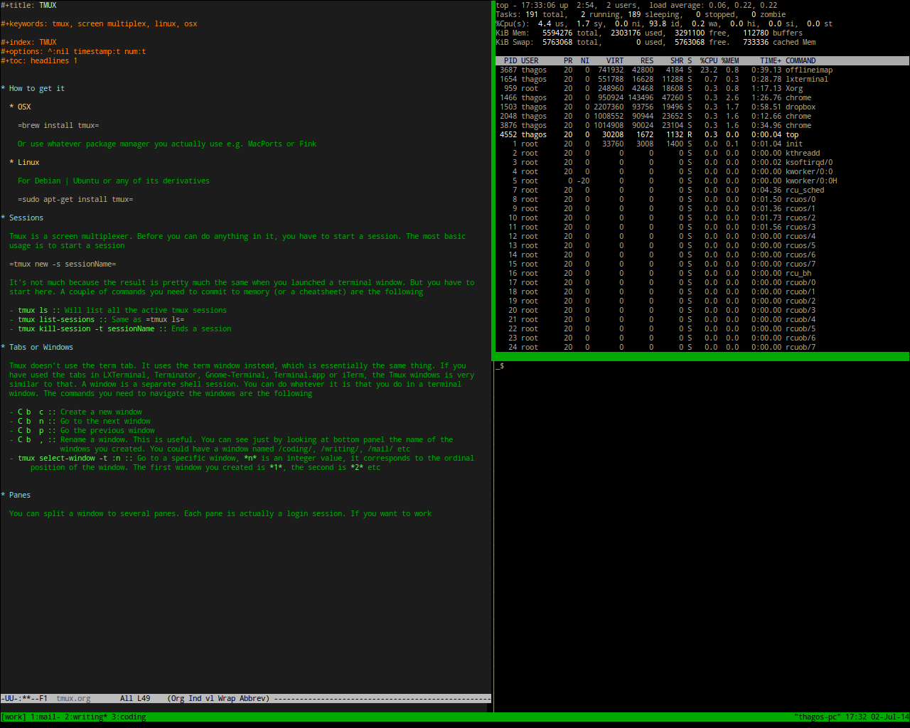

---

title: Using tmux
author: Ted Hagos

---

# How to get it

In OSX, you can `brew install tmux`. Or use whatever package manager it is that you actually use e.g. MacPorts, Fink.

In Linux, use `sudo apt-get install tmux`. Apt get is for Debian and Ubuntu based Linux distributions. Use the package manager appropriate for your distro e.g. yum for CentOS and Fedora

# Sessions

Tmux is a screen multiplexer. Before you can do anything in it, you have to start a session. The most basic usage is to start a session

`tmux new -s sessionName`

It's not much because the result is pretty much the same when you launched a terminal window. But you have to start here. A couple of commands you need to commit to memory (or a cheatsheet) are the following

-   **tmux ls:** Will list all the active tmux sessions
-   **tmux list-sessions:** Same as `tmux ls`
-   **tmux kill-session -t sessionName:** Ends a session
-   **tmux attach-session -t sessionName:** reattach a tmux session to a different terminal. Just in case you accidentally clicked the "Close window" button on a terminal, the tmux session is not lost. You can launch another terminal then re-attach the tmux session to the new terminal

# Tabs or Windows

Tmux doesn't use the term tab. It uses the term window instead, which is essentially the same thing. If you have used the tabs in LXTerminal, Terminator, Gnome-Terminal, Terminal.app or iTerm, the Tmux windows is very similar to that. A window is a separate shell session. You can do whatever it is that you do in a terminal window. The commands you need to navigate the windows are the following
-   **C b  c:** Create a new window
-   **C b  n:** Go to the next window
-   **C b  p:** Go the previous window
-   **C b  ,:** Rename a window. This is useful. You can see just by looking at bottom panel the name of the windows you created. You could have a window named *coding*, *writing*, *mail* etc
-   **tmux select-window -t :n:** Go to a specific window, **n** is an integer value, it corresponds to the ordinal position of the window. The first window you created is **0**, the second is **1** etc

`C b` means press `CTRL + b`, you will use that a lot because you need to prefix every tmux command with it. So
release it, then press `c`. So `C b  c` means press `CTRL + b`, release it, then press `c`.

# Panes

You can split a window to several panes. Each pane is actually a login session.

The sample pic above is a tmux window that is split three ways. One is for editing a doc, the other one is shows the output of **top** and the other one is just spare, just in case there is a need to execute another shell command. The commands you need for panes are the following

-   **C b  " :** Split the Window vertically
-   **C b  % :** Split the window horizontally
-   **C b  <arrow right | left>:** Resize the window horizontally
-   **C b  <arrow up | down>:** Resize the window vertically
-   **C b q:** Find out the panel numbers

# Customization

Tmux will work out of the box. If you need to tweak it a bit, you can. Upon startup, tmux looks for a file named `~/.tmux.conf`, if it doesn't find any, it's not a big deal, it will just proceed. But if it finds one, it will read the contents of that configuration file.

You can change the behavior of Tmux using the config file. You can change the key bindings for example, so in case `C b` gives you CTS, you might want to change that key binding for the prefix command of Tmux, say `C v` so that its not much of a stress. Here are some samples entries that you can put inside the config file

-   **set -g prefix C-v:** Changes the prefix command from `C b` to `C v`
-   **unbind C-b:** Removes the default prefix command
-   **bind | split-window -h:** So that instead of keying C b " to split the window horizontally, you can key in `C b  |` instead
-   **bind - split-window -v:** This is the vertical split. Instead of `C b  %`, it will now be `C b  -`

[A sample tmux.conf file](resources/tmux.conf.txt), if you want to use this, make sure you rename it `.tmux.conf` and place it in your home folder.

# Scripting tmux

# References

1.  Sourceforge , "Tmux", <http://tmux.sourceforge.net>
